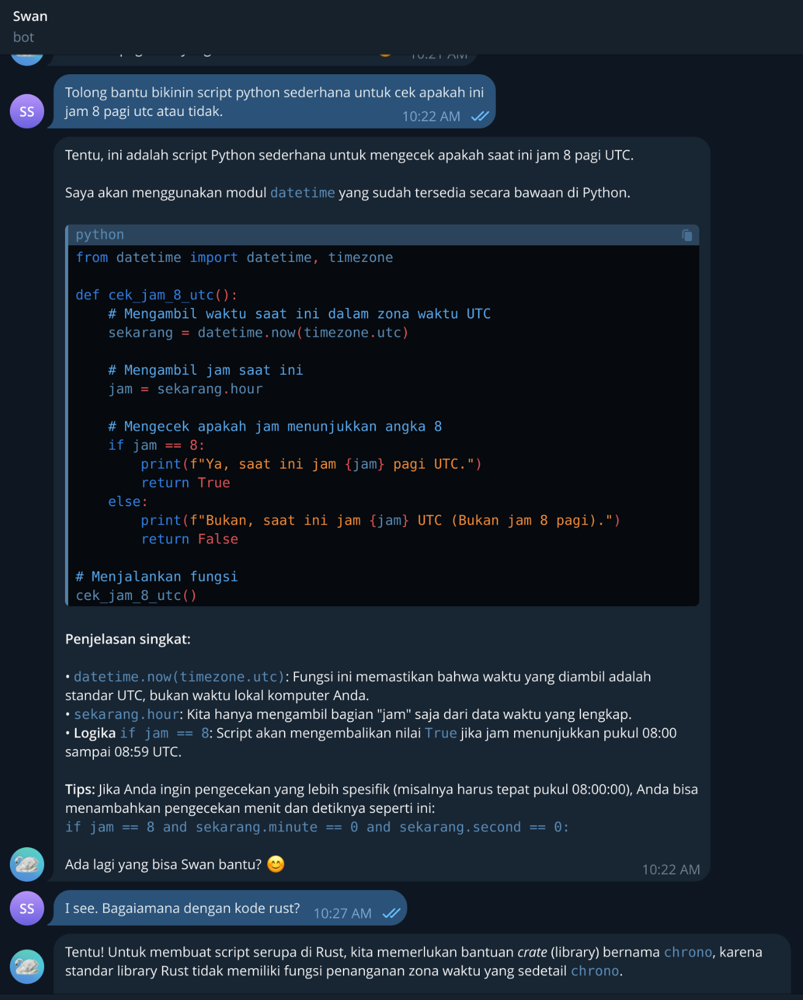
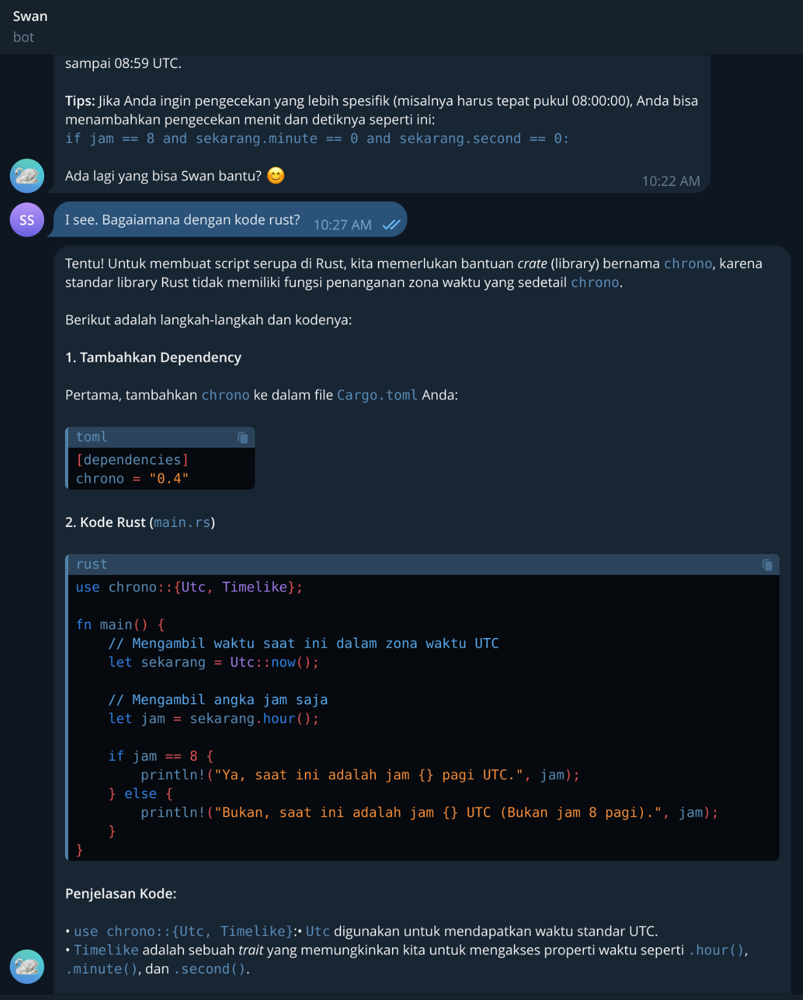

# SWAN (Stateful Workspace Assistant Network)

Halo there, meet me Swan. A telegram bot for private virtual assistant.

## Tech Stack

I am built on top of the following stack:

* Rust (as fast as C but with memory and data safety in mind).
* Axum (backend with some security middlewares added).
* Sea-orm (database ORM to handle various database operation).
* Tokio (Async libraries).
* Rig (Gen AI framework).
* Together (Model backend)
* Gemini (Model inference)
* Open Router (Model backend and inference)

## Features

I have several important features to support my capabilities.

* Unauthorized bot protection.
* Unauthorized user protection.
* New guest registration reply.
* User profile identification.
* User quota chat limitation.
* Session aware chat based (timeout: 30 minutes, after 30 minutes session will be reset to a new one with summarized history).
* Custom prompt and custom base url to ensure you can bring your very own (local) LLM.
* Support both, withTool and withoutTool config for each agent by calling a single function for every provider.
* Markdown formatter to ensure all AI format will be used by the chat.
* Custom Error to match your needs in a single error enum.
* Chat summary as initial history [TBA]
* Process messages concurently using async features [TBA]
* Multi task recoginition: RAG, conversation, tools execution [TBA]

## How To [TBA]

## Some Screenshots

